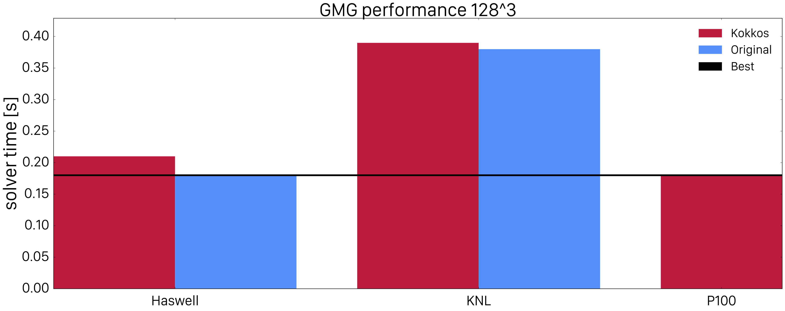

# Performance Comparison

Here we summarize the performance of the BoxLib geometric multigrid solver when
implemented with the various performance portable solutions described on this
site. This page will be updated frequently whenever new ports, frameworks or compiler versions are available.

Note that the parallelization approach differs between the original code and the portable ones: while the original code deploys one OpenMP thread to each tilebox, the portable approaches deploy all available threads to a given box. Therefore, the most optimal configuration for solving a problem of a given global box size can be different. For example the number of subboxes the global box is subdivided into as well as the number/sizes of tiles per subbox can be different. We chose the best configuration for each architecture and approach, obtained by performing a grid search. In order to explore architectural advantages we performed all tests on a $128^3$ and $256^3$ boxes.
The results are displayed in the two bar charts below.

The figures exhibit that Kokkos performance on Haswell is similar to the original OpenMP implementation for various problem sizes. On KNL and smaller volumes, the behaviour is similar but Kokkos performance drops rapidly for larger volumes. This might be attributed to performance differences in the coarse or fine grained parallelism implementations. However, one would expect that the Kokkos implementation would be more efficient because it allows for exposing better cache locality by utilizing fine grained blocking. This performance difference is not fully understood and needs further investigation. 
On the GPU side, the plot shows that Kokkos is very efficient especially for large problem sizes. In that sense, Kokkos can be recommended for achieving performance portability on multi-core CPU and GPU architectures. For many-core architectures, there are some performance problems which need to be investigated.