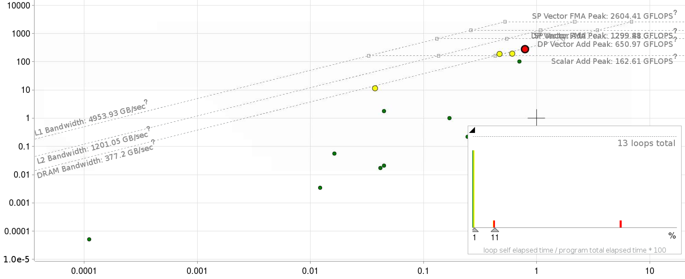
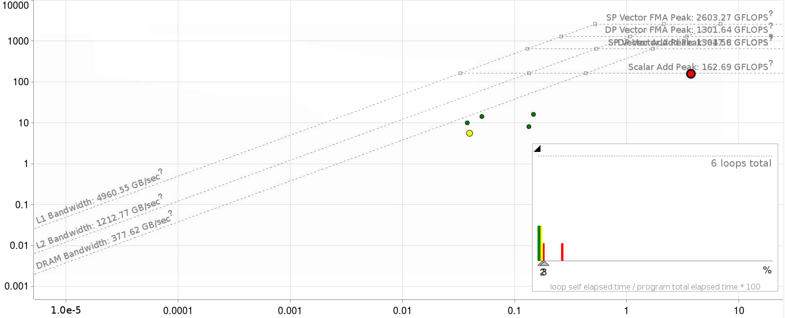

# Overview of BerkeleyGW Case Study

## Description

BerkeleyGW is a material science application that predicts the excited-state properties of a wide range of materials from molecules and nanostuctures to
crystals - including systems with defects and complex interfaces. The excited-state properties of materials (properties associated with electrons in states
above the lowest energy configuration) are important for a number of important energy applications including the material design of batteries,
semiconductors, quantum computing devices, photovoltaics and emitting devices among others. The BerkeleyGW application is commonly used in
conjunction with Density Functional Theory (DFT) applications like Quantum ESPRESSO, PARATEC, ABINIT which compute accurately the ground-state properties of
materials. In BerkeleyGW, the electronic energies are computed as a solution to the so-called Dyson equation:

$$
\left[ -\frac{1}{2}\nabla^2+V_{\rm loc}+\Sigma(E_{n}) \right] \phi_{n}=E_{n}\phi_{n},
$$

which is similar in form to the DFT Kohn-Sham equations with the addition of the energy-dependent Self-Energy operator $\Sigma$.

BerkeleyGW contains many of the computational bottlenecks of DFT applications including a significant amount of time spent in FFTs and dense linear algebra.
Additionally, similarly to quantum chemistry packages, there are a number of tensor-contraction operations that cannot be performed in library calls. One such
occurrence is the evaluation of the electron "Self-Energy" within the common General Plasmon Pole (GPP) approximation:

$$
\Sigma_{n}=
\sum_{n'}\sum_{{\bf GG}'}
M^{*}_{n'n}(-{\bf G})M_{n'n}(-{\bf G}')\frac{\Omega^2_{{\bf GG}'}}
{\tilde{\omega}_{{\bf GG}'}
\left(E\,{-}\,E_{n'}{-}
\tilde{\omega}_{{\bf GG}'}\right)}
v{\left({\bf G}'\right)}
$$

where $M$, $\Omega$ and $\tilde{\omega}$ are pre-computed complex double-precision arrays. In this report, we focus on the evaluation of this expression (the GPP kernel), which is a
major bottleneck in the application.

## Implementation

The fact that the denominator in the above equation depends on $n'$, $G$ and $G'$ means it is difficult to write the matrix-reduction using standard
math-libraries. The baseline code is implemented in FORTRAN-90 utilizing an MPI+OpenMP parallel approach, with care given to ensure a vectorizable inner loop. MPI parallelism is
generally used to parallelize over $n$ and $n'$, while OpenMP parallelizes the $G'$ loop and the $G$ loop is left for vectorization. Significant data re-use of
the arrays is possible if many values of $E$ are required. At minimum, we require three $E$ values; which leads to an arithmetic intensity of > 1. An initial
roofline plot for KNL Xeon processors are shown below.

The gap between the code performance and the ceiling can be explained via two factors: 1. the code lacks multiply-add symmetry and 2. the divide instruction has a
multi-cycle latency.

Shown below are the roofline plots of the application kernel with fortran and C++ implementations respectively.

