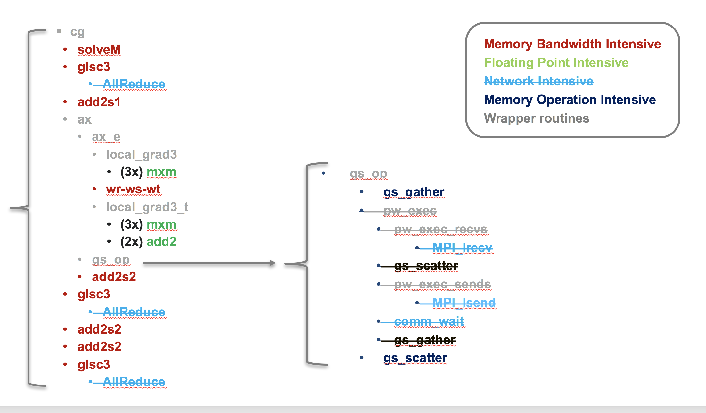

#Analysis of Nekbone Performance and Portability

## Introduction
Nekbone is a mini-app derived from the [Nek5000](https://nek5000.mcs.anl.gov/) CFD code which is a high order, incompressible Navier- Stokes CFD solver based on the spectral element method. It exposes the principal computational kernels of Nek5000 to reveal the essential elements of the algorithmic-architectural coupling that are pertinent to Nek5000.

Nekbone solves a standard Poisson equation in a 3D box domain with a block spatial domain decomposition among MPI ranks. The volume within a rank is then partitioned into high-order quadrilateral spectral elements. The solution phase consists of conjugate gradient iterations that invoke the main computational kernel which performs operations in an element-by-element fashion. The code is written in Fortran and C, where C routines are used for the nearest neighbor communication and the rest of the routines are in Fortran. It uses hybrid parallelism implemented with MPI and OpenMP.

## Description

Nekbone solves a standard Poisson equation using the spectral element method with an iterative conjugate gradient solver with a simple preconditioner. The computational domain is partitioned into high-order quadrilateral elements. Based on the number of elements, number of processors, and the parameters of a test run, Nekbone allows a decomposition that is either a 1-dimensional array of 3D elements, or a 3-dimensional box of 3D elements. The benchmark is highly scalable and can accommodate a wide range of problem sizes, specified by setting the number of spectral elements per rank and the polynomial order of the elements by editing the appropriate build and input files.

The benchmark consists of a setup phase and a solution phase. The solution phase consists of conjugate gradient iterations that call the main computational kernel, which performs a matrix vector multiplication operation in an element-by-element fashion.  Overall each iteration consists of vector operations, matrix-matrix multiply operations, nearest-neighbor communication, and MPI Allreduce operations. The benchmark is written in Fortran and C, where C routines are used for the nearest neighbor communication and the rest of the compute kernel routines are in Fortran. Note that the CORAL version of the benchmark is implemented using OpenMP and MPI and may be run with a varied mixture of threads and processes.

The benchmark is intrinsically well load balanced, with each process having the same number of spectral elements and therefore the same amount of computational work.  Communication consists of nearest neighbor point-to-point communication with up to 26 surrounding processes and MPI Allreduce operations. While the amount of data communicated with neighboring processes can vary somewhat between processes, depending on proximity to the domain boundaries, on most systems the effects of this imbalance has been observed to be minimal. For systems where MPI reduction operations scale and point-to-point communications are non-interfering between network nodes the performance of the benchmark has been observed to scale nearly linearly with increasing number of nodes across several orders of magnitude. At the node level elements are distributed across threads and communication gather-scatter operations are performed cooperatively between threads. Good scaling to ten’s of OpenMP threads has been observed when elements are distributes evenly across threads and times for OpenMP synchronization operations in the gather-scatter and MPI reduction operations are not excessive.

##Structure

The diagram below shows a schematic view of the Nekbone solver. While Nekbone is implemented with using MPI and is highly scalable the investigation of performance and portability across node architecture is being performed using a single node build that makes no MPI calls, this serves to isolate the impact of node architecture from network effects. The disabled routines in the single node build are shown as crossed out in the figure.

##Implementations

Comparisons were performned using an OpenMP implementation on the CPU and an OpenACC implementation on the GPU. Further details will be added describing the code moficiations but in both cases modifications were not significant, consisting primarily of the addition of pragmas. The OpenMP implementation utilized coarse grained parallelism wherein only a single parallel region is utilized spanning the entire solver and work is apportioned to threads by a static mapping of spectral elements to threads. The OpenACC implementation minimizes data movement between the CPU and GPU by keeping all of the data resident on the GPU. :wq

##Performance
The figure below compares the performane of Nekbone on the Intel Xeon Phi "Knights Landing" with the performance on the nVidia Tesla P100 GPU. On both platforms the same set of cases were run, where the number of spectral elements was increased from 1 to 2048. On the Knights Landing processor OpenMP was utilized to enable thread parallelism, while on the P100 OpenACC was utilized to enable execution on the GPU. On both architectures a minimum problem size was required to saturate the performance on the node, with the GPU requiring a significantly larger problem 32-64x larger than the CPU. On the CPU several implementation of the floating point intensive small matrix multiply kernels were tested, the "naive" matrix multiply yielded the worst performance. Notable improvements were seen when the inner matrix multiply loop was handle unrolled, noted as the "unrolled" case in the figure. Finally the best CPU performnance was seen utilizing customized AVX512 assembly routines from the XSMM library. On the GPU a "niave" matrix multiply routine was implemented, which outperforms the naive CPU code at high degrees of freedom, but lags the optimized CPU implementations. Further work on optimized GPU implementations is ongoing and is expected to yield improved GPU performance.

