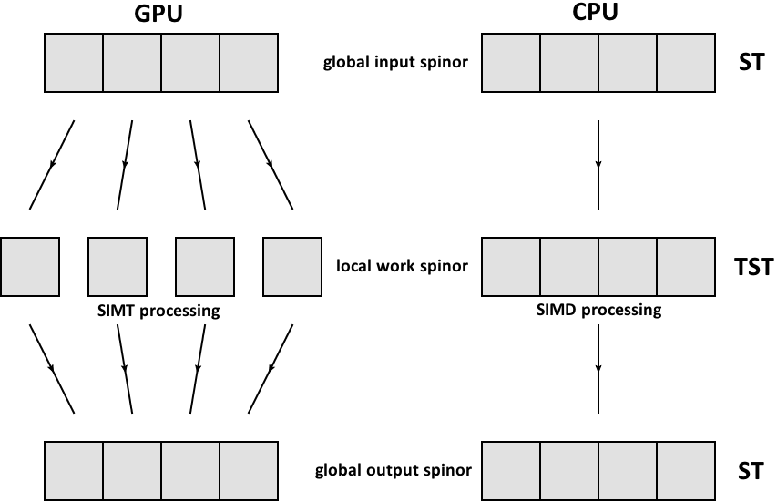

# Code Structure

Our testcode is written in C++ and designed completely from scratch. We use type definitions, templates, template-specialization, overloading and other C++ features to provide flexibility in changing precision, testing datatypes which help vectorization and also making it easier to hide architecture dependent code. The general idea is to decompose the problem into a loop over lattice site and then for each lattice site and each direction, we:

* stream-in the relevant spinors (or block of spinors in case of multiple right hand sides) from memory
* project 4-spinors to 2-spinors
* read relevant gauge links and apply the dslash to those vectors
* inject 2-spinors into 4-spinors
* stream-out the solution vectors to memory

In multi-node implementations the application step would be separated into bulk- and boundary application and the former interleaved with boundary communication.

## Data Primitives
For facilitating this workflow, we define spinor and gauge link classes (in C++-like pseudocode):

```C++
template<typename ST,int nspin> 
class CBSpinor {
public: 
    ...
private:
    // dims are: site, color, spin
    spin_container<ST[site,color,spin]> data;
};

template<typename GT> 
class CBGaugeField {
public:
    ...
private:
    // dims are: site, direction, color, color
    gauge_container<GT[site,4,3,3]> data;
};
```

here, ST and GT refer to spinor-type and gauge-type respectively. Those types could be SIMD or scalar types and they do not neccesarily need to be the same. The data containers can be plain arrays, e.g. for (unportable) plain implementations, or arrays decorated with pragmas (e.g. for OpenMP 4.5 offloading) or more general data container classes such as Kokkos::Views, etc.. The member functions are adopted to the container classes used in the individual implementations. Note that this design allows us to test different performance portable frameworks/methods without having to restructure large parts of the code. The additional template paramter ```nspin``` allows us to easily define 2- and 4-spinor objects. 


## Wilson Operator

At this point in time, the dslash testcode is not multi-node ready, so we will focus solely on on-node parallelism for the moment. Our goal is to achieve this by threading over lattice sites and applying SIMD/SIMT parallelism over multiple right hand sides. In theory, one could achieve vectorization for single right hand side vectors also by using an array or structure of array data layout but we will not consider this technique here. We will nevertheless compare our single right hand side performance we achieved with our performance portable implementations with those of optimized libraries which feature such improvements.

Our dslash class is implemented as follow:

```C++
template<typename GT, typename ST, typename TST>
class Dslash {
    public:
    void operator(const CBSpinor<ST,4>& s_in,
                  const CBGaugeField<GT>& g_in,
                  CBSpinor<ST,4>& s_out,
                  int plus_minus) 
    {
        // Threaded loop over sites
        parallel_for(int i=0; i<num_sites; i++){
            CBThreadSpinor<TST,4> res_sum_;
            CBThreadSpinor<TST,2> proj_res, mult_proj_res;
        
            //go for directions +T
            //stream-in from +T direction and project to 2-spinor
            project_dir<ST,TST>(s_in[i], i, proj_res, T_PLUS);
            //multiply with gauge link
            mult_adj_u_halfspinor<GT,TST>(g_in[i][T_PLUS], proj_res, mult_proj_res);
            //reconstruct and add to result
            reconstruct_dir<TST,ST>(mult_proj_res, res_sum);
            
            //go for direction -T
            ...
        }
    }
};
```

Here, the type ```TST``` denotes a thread-spinor-type which belongs to the ```CBThreadSpinor``` class. It is important to make the distinction between ```CBSpinor``` and ```CBThreadSpinor``` because, depending on the performance portability framework used, this type has to be different on CPU or GPU. What we would like to achieve ultimately is displayed in the picture below:



In case of the GPU (left), individual threads are each working on a single/scalar entry of the global spinor, i.e. on a single right hand side component. In case of the CPU (right), each thread is working on a chunk of right hand sites, ideally using its vector units. In both cases, the input and output spinor datatype is the same and the work spinor type is optimized for the targeted architecture. 

Note that, similar to the data classes discussed above, this skeleton-dslash allows us to specialize the Wilson operator for a variety of performance portable frameworks. Additionally, if we need more architectural specialization than the various frameworks could offer, this can be implemented cleanly by operator overloading and template specializations.