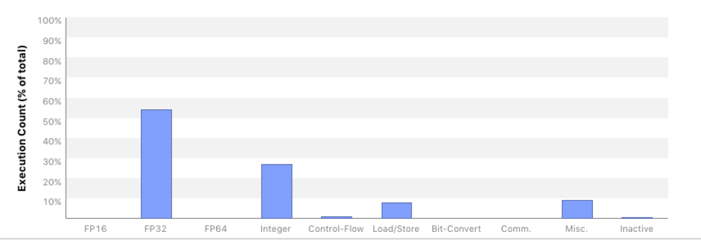

# Kokkos Implementation

In Kokkos, it is advised to use the ```Kokkos::View``` datatype as our data container. Therefore, the [spinor and gaugefield classes](./code_structure.md#Data_Primitives) become

```C++
template<typename ST, int nspin>
class CBSpinor {
public: 
    // Define a type handle for the Kokkos View in this class (a Trait)
    // dims are: site, color, spin
    using DataType =  Kokkos::View<ST*[3][nspin],Layout,MemorySpace>;
 
    // Get the actual Kokkos views...
    const DataType& GetData() const { return _data; }
    DataType& GetData { return _data; }
private:
    DataType _data;
};

// Convenient Name for the View inside a 4 spinor
template<typename ST>
using SpinorView = typename CBSpinor<ST,4>::DataType; 

template<typename GT> 
class CBGaugeField {
public:
    // Define a type handle for the Kokkos View in this class (a Trait)
    // dims are: site, direction, color, color	
    using DataType =  Kokkos::View<GT*[4][3][3],GaugeLayout,MemorySpace>;
   
    // Get the actual Kokkos views...
    const DataType& GetData() const { return _data; }
    DataType& GetData { return _data; }
private:
    DataType _data;      
};

// A Handle for the View part of the Gauge Field
template<typename GT>
using GaugeView = typename CBGaugeField<GT>::DataType;

```

In each container class, we defined a ```DataType``` to be an appropriate ```Kokkos::View``` for that object.
Note that in the Views the site index dimension is a runtime dimension (denoted by ```*```) whereas the other dimensions - color and spin - are fixed (denoted by ```[const]```). Explicitly stating this is recommended by the kokkos developers because it should help the compiler to optimize the code.

Here ```Layout```, ```GaugeLayout``` and ```MemorySpace``` are policies we set at compile time in 
a single header file, based on architecture e.g. for KNL one would have:

```C++
using ExecSpace = Kokkos::OpenMP::execution_space;
using MemorySpace = Kokkos::OpenMP::memory_space;
using Layout = Kokkos::OpenMP::array_layout; 
using GaugeLayout = Kokkos::OpenMP::array_layout;
using NeighLayout = Kokkos::OpenMP::array_layout;
using ThreadExecPolicy = Kokkos::TeamPolicy<ExecSpace>;
```

whereas the appropriate settings for Single Right Hand Side Dslash for GPUs were:
```C++
using ExecSpace = Kokkos::Cuda::execution_space;
using MemorySpace = Kokkos::Cuda::memory_space;
using Layout = Kokkos::Cuda::array_layout;
using GaugeLayout = Kokkos::Cuda::array_layout;
using NeighLayout = Kokkos::Cuda::array_layout;
using ThreadExecPolicy =  Kokkos::TeamPolicy<ExecSpace,Kokkos::LaunchBounds<128,1>>;
```
Finally we note that when a VectorType is used (see below) the setting for ```Layout```, ```GaugeLayout```, and ```NeighLayout```
was ```Kokkos::LayoutRight``` for both CPU and GPU.

Care needs to be taken whether one passes by value or reference, as in an environment involving GPUs
one cannot pass references to data on the host to the GPU (unless one uses Unified Virtual Memory -- UVM).
Attempting to do so can lead to a run-time error. Also, we have found that one should not execute Kokkos
parallel regions in the class constructor. Kokkos Views are small objects with a pointer potentially to memory
in the appropriate ```MemorySpace```. They are cheap to copy, and it help avoiding programming errors if we can
pass the views directly to our kernels, rather than passing the wrapper ```CBSpinor``` objects. Hence we define
accessors: ```GetData()``` for both our wrapper classes, and we also define the shorthand type aliases ```SpinorView``` and
```GaugeView``` for the Kokkos views as used in spinors or gauge fields respectively.

It is common in lattice QCD to apply Dslash for both checkerboards and parities, and these are usually given
as run-time parameters to a DSlash operator. In order to give the compiler maximum information, and to avoid
unnecessary register spilling on GPUs we wanted to make these parameters essentially compile time. Hence we defined 
a functor class ```DslashFunctor``` whose ```operator()``` implements the Dslash as discussed in [Wilson operator class](./code_structure.md#wilson_operator).

```C++
template<typename GT, typename ST, typename TST, const int isign, const int target_cb>
struct DslashFunctor { 
  SpinorView<ST> s_in;          // These are the Kokkos::Views
  GaugeView<GT> g_in_src_cb;
  GaugeView<GT> g_in_target_cb;
  SpinorView<ST> s_out;
  int num_sites;
  int sites_per_team;
  SiteTable neigh_table;

  KOKKOS_FORCEINLINE_FUNCTION
  void operator()(const TeamHandle& team) const {
    const int start_idx = team.league_rank()*sites_per_team;
    const int end_idx = start_idx + sites_per_team  < num_sites ? start_idx + sites_per_team : num_sites;

    Kokkos::parallel_for(Kokkos::TeamThreadRange(team,start_idx,end_idx),[=](const int site) {
     
      // Body as per the previous pseudocode
      SpinorSiteView<TST> res_sum;
      HalfSpinorSiteView<TST> proj_res;
      HalfSpinorSiteView<TST> mult_proj_res;

      for(int color=0; color < 3; ++color) {
        for(int spin=0; spin < 4; ++spin) {
          ComplexZero(res_sum(color,spin));
        }
      }
                        
      // T - minus
      KokkosProjectDir3<ST,TST,isign>(s_in, proj_res,
                             neigh_table.NeighborTMinus(site,target_cb));
      mult_adj_u_halfspinor<GT,TST>(g_in_src_cb,proj_res,mult_proj_res,
                             neigh_table.NeighborTMinus(site,target_cb),3);
      KokkosRecons23Dir3<TST,isign>(mult_proj_res,res_sum);

      // ... other directions....
    });
  }
};
```         

and one can see that the functor operates directly on ```Kokkos::View``` data members and that
apart from the ``site``` other indexing parameters such as target_cb are compile time through templates.

To still allow choices of ```target_cb``` and ```isign``` (whether to apply Dslash or its hermitian conjugate)
the top-level ```Dslash``` class looks like:

```C++
template<typename GT, typename ST, typename TST>
class KokkosDslash {
public:
  void operator()(const CBSpinor<ST,4>& spinor_in,
                  const GaugeField<GT>& gauge_in,   // contains CBGaugeField for both cb-s
                  CBSpinor<ST,4>& spinor_out,
                  int plus_minus) const
  {
    int source_cb = spinor_in.GetCB();
    int target_cb = (source_cb == EVEN) ? ODD : EVEN;
    const SpinorView<ST>& s_in = spinor_in.GetData();
    const GaugeView<GT>& g_in_src_cb = (gauge_in(source_cb)).GetData();
    const GaugeView<GT>&  g_in_target_cb = (gauge_in(target_cb)).GetData();
    SpinorView<ST>& s_out = spinor_out_out.GetData();

    ...

    // Create a Team policy, and inform it of the Vector Length
    ThreadExecPolicy policy(num_sites/_sites_per_team, Kokkos::AUTO(),Veclen<ST>::value);

    // Ugly if-else to turn plus_minus & target_cb into 
    // constant template arguments
    if( plus_minus == 1 ) {
      if (target_cb == 0 ) {
        // Instantiat appropriate functor and construct
        // All view initializations will be done by copy
        // the values of plus_minus (1) and target_cb (0)
        // are made explicit and compile time in the template
        // arguments
        DslashFunctor<GT,ST,TST,1,0> f = {s_in, g_in_src_cb, g_in_target_cb, s_out,num_sites, _sites_per_team,_neigh_table};
        
	      // Dispatch the thread Teams				       
          Kokkos::parallel_for(policy, f); // Outer Lambda 
      }
      else {
        ... // Instantiate DslashFunctor for target_cb=1 & Dispatch        
      }
    }
    else { 
      // plus_minus == -1 case, target_cb=0,1 cases
      ...
    }
  }
};
```

In the above, the GPU Threads in the $X$ drection are created, when we call ```Kokko::parallel_for``` with the ```ThreadExecPolicy```, to which we have given a vector length through the ```Veclen<ST>::veclen``` type trait. The nested ```if-else``` clauses turn run-time
parameters into template parameters. Finally, the member data of the ```DslashFunctor``` are initialized by copy.

Note that since we linearized the site index, we need to compute the neighboring site indices manually. On architectures with poor integer arithmetic performance this might lead to a significant performance penalty. Therefore, we implement a ```SiteTable``` class with
member functions like ```NeighborTMinus(site,target_cb)``` to give the linear site indices of the neighbors. The instance of this site table is the ```_neigh_table``` member in the ```KokkosDslash``` class and is used to initialize the ```neigh_table``` member of the ```DslashFunctor```. Our implementation is such that ```SiteTable``` either holds a pre-computed neighbor table or computes the site neighbor for a given direction on the fly. In our performance measurements we use the implementation which gives the best performance for a given architecture.

## Complex Numbers and C++
We want to emphasize a subtle performance pitfall when it comes to complex numbers in C++. The language standards inhibit the compiler to efficiently optimize operations such as 

```C++
c += a * b
``` 

when ```a```, ```b``` and ```c``` are complex numbers. Naively, this expression could be expanded into 

```C++
re(c) += re(a) * re(b) - im(a) * im(b)
im(c) += re(a) * im(b) + im(a) * re(b)
``` 

where ```re(.), im(.)``` denote the real and imaginary part of its argument respectively. This expresson can nicely be packed into a total of four FMA operations per line. However, in the simplified form above which is usually used in context of operator overloading, the compier would have to evaluate the right hand side first and then sum the result into ```c```. This is much less efficient since in that case, only two FMA as well as two multiplications and additions could be used. One has to keep that in mind when doing complex algebra in C++. In many cases it is better to inline code and avoid otherwise useful operator overloading techniques for complex algebra.

## Ensuring Vectorization
Vectorization in Kokkos is achieved by a two-level [nested parallelism](../../perfport/frameworks/kokkos.md#nested-parallelism), where the outer loop spawns threads (pthreads, OpenMP-threads) on the CPU and threads in CUDA-block y-direction on the GPU. The inner loop then applies vectorization pragmas on the CPU or spwans threads in x-direction on the GPU. This is where we have to show some awareness of architectural differences: the spinor work type ```TST``` needs to be a scalar type on the GPU and a vector type on the CPU. Hence we declare the following types on GPU and CPU respectively

```C++
template<typename T,N> 
struct CPUSIMDComplex {
  Kokkos::complex<T> _data[N];
    
  T& operator()(int lane) {
    return _data[lane];
  }
  
  ...
};

template<typename T,N> 
struct GPUSIMDComplex {
  Kokkos::complex<T> _data;
    
  T& operator()(int lane) {
    return _data;
  }
  
  ...
};
```

The latter construct might look confusing first, because the access operator ignores the ```lane``` parameter. This is because the SIMT threading is implicit in Kokkos and each SIMT thread is holding it's own data ```_data```. Nevertheless, it is useful to implement the access operator that way to preserve a common, portable style throughout the rest of the code. An example of manipulating these types
in a unified way with templates is given below, for the ```ComplexCopy``` operation:

```C++
// T1 must support indexing with operator()
template<typename T, int N, 
        template <typename,int> class T1, 
        template <typename,int> class T2>
KOKKOS_FORCEINLINE_FUNCTION
void ComplexCopy(T1<T,N>& result, const T2<T,N>& source)
{
  Kokkos::parallel_for(VectorPolicy(N),[&](const int& i) {
    result(i) = source(i);      
  });
}
```

Suppose that ```T1``` is ```SIMDComplex``` and ```T2``` is also ```SIMDComplex``` as one would have on a CPU. Then the ```Kokkos::parallel_for``` will expand into a loop, possibly decorated with ```#pragma ivdep``` and this code will copy all the actual elements of ```source``` into ```result```. However, on the GPU,  if ```result``` is of type ```GPUSIMDComplex``` and the ```ExecutionPolicy``` set up the warp threads in the X-direction, this code should instead reduce to:

```C++
{
  result._data  = source(threadIdx.x);
}
```
in other words the routine is capable also of splitting the ```SIMDComplex``` into its lanes for the threads in the X-direction 
(and vice versa if ```source``` and ```destination``` are interchanged).

### Specialization for CPU
In theory, these two types are sufficient for ensuring proper vectorization on both CPU and GPU. In our experiments however, we found that neither Intel nor GNU compiler could vectorize the complex operations inside the spinors properly, leading to a very poor performance. This is not a problem of Kokkos itself, it is merely the inability of compilers to efficiently vectorized complex algebra.
We therefore provided a template  specialization for the ```CPUSIMDComplex``` datatype which we implemented by explicitly using AVX512 intrinsics. For example, the datatype then becomes

```C++
template<>
struct CPUSIMDComplex<float,8> {
  explicit CPUSIMDComplex<float,8>() {}
    
  union {
    Kokkos::complex<float> _data[8];
    __m512 _vdata;
  };
  
  ...
};
```

and, for example, the vectorized multiplication of two complex numbers

```C++
template<> KOKKOS_FORCEINLINE_FUNCTION
void ComplexCMadd<float,8,CPUSIMDComplex,CPUSIMDComplex>(CPUSIMDComplex<float,8>& res,
                                                         const Kokkos::complex<float>& a,
                                                         const CPUSIMDComplex<float,8>& b)
{ 
  // Broadcast real and imaginary parts of 'a' into vector registers
  __m512 avec_re = _mm512_set1_ps( a.real() );
  __m512 avec_im = _mm512_set1_ps( a.imag() );

  // A vector of alternating +/- 1s;
  __m512 sgnvec = _mm512_set_ps( 1,-1,1,-1,1,-1,1,-1,1,-1,1,-1,1,-1,1,-1);

  // A permutation of b's real and imaginary parts, with the sign vector multiplied in.
  __m512 perm_b = _mm512_mul_ps(sgnvec,_mm512_shuffle_ps(b._vdata,b._vdata,0xb1));

  // 2 FMAs.
  res._vdata = _mm512_fmadd_ps( avec_re, b._vdata, res._vdata);
  res._vdata = _mm512_fmadd_ps( avec_im,perm_b, res._vdata);
}
```

Note that we use inter-lane shuffle operations to swap complex and imaginary parts and use vectorized FMA operations. We suspect that compilers are unable to detect the opportunity of performing those inter-lane shuffles and thus fail to properly vectorize the code. The amount of specialization employed here is contained in about 14 functions spreading across 182 lines of code. This is not a huge investment and also does not really destroy portability as most of the code is still written in a portable way.

### Specialization for GPU
Although vectorization issues are usually less severe on SIMT architectures, we ran into problems of vectorized loads and stores of complex numbers. using ```nvprof```, we found that a load and store of a ```Kokkos::complex``` instance created two transactions, i.e. one for the real and one for the imaginary part. The ```nvprof``` screenshot shown below illustrates this issue.


These *split-transactions* have the potential of wasting bandwidth and thus should be avoided. A (partial) solution is to use CUDA 9 instead of CUDA 8: apparently, the compiler improved so that it is able to remove at least all the split stores, but not all split loads.
To improve that situation, we decide to write our own complex class which we derived from the CUDA ```float2``` datatype (this is for single precision, one could use ```double2``` for double precision). By doing so, we make sure that the data member has correct alignment properties and thus helps the compiler to issue optimized store and load iterations. The implementation of this class is sketched below.

```C++
template<>
class GPUComplex<float> : public float2 { 
public:
  explicit KOKKOS_INLINE_FUNCTION GPUComplex<float>() {
    x = 0.;
    y = 0.;
  }

  template<typename T1, typename T2>
  explicit  KOKKOS_INLINE_FUNCTION GPUComplex<float>(const T1& re, const T2& im) {
    x = re;
    y = im;
  }
    
  explicit KOKKOS_INLINE_FUNCTION GPUComplex<float>(const float& re, const float& im) {
    x = re; y = im;
  }
    
  template<typename T1>
  KOKKOS_INLINE_FUNCTION GPUComplex<float>& operator=(const GPUComplex<T1>& src) {
    x = src.x;
    y = src.y;
    return *this;
  }

  ...
};
```

The part abbreviated by the ellipsis only contains further assignment or access operators, no complex math. Because of the issues with complex arithmetic in C++ mentioned above, we explicitely write those operations in terms of real and imaginary parts. 
Using this class got rid of all uncoalesced data access issues even in CUDA 8. This can be inferred by looking at the ```nvprof``` output in which the corresponding sections are not marked as hotspots any more. 

Note that despite our improvements of complex load and store instructions, the kernel performance barely changed. This incidates that on the GPU the performance is still limited by something else, probably memory access latency. 

# Index Computations

Investigating this issue with ```nvprof``` indicates that performance might be impacted by significant integer calculation overhead. For example, the first screenshot below shows the instruction decomposition for the Wilson operator from the optimized [QUDA library](https://github.com/lattice/quda).



It exhibits that about 55% of all instructions are floating point instructions, there is basically no flow control and only about 28% integer arithmetic. For the Kokkos kernel ```nvprof``` shows the following picture.


This shows that our floating point instruction ratio is only 28%, whereas integer and control flow counts are notably higher, namely 38% and 15% respectively. We are still investigating, whether the extra integer operations arise from our own integer computations or from those of Kokkos indexing into views. If it is the latter, we may be able to further reduce these by using Kokkos' subview mechanism. Excessive integer operations can hurt performance also on KNL, where integer operations are not vectorized, and indeed on KNL best performance is typically seen when the ```SiteTable``` is operated in lookup table mode.