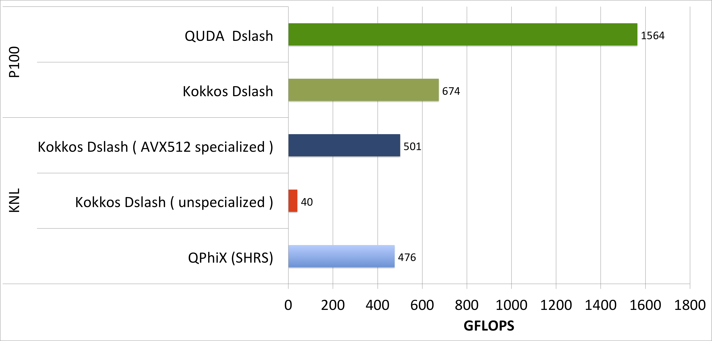

# Results

In order to assess the performance on KNL and GPU architectures, we compare against the highly optimized libraries [QPhiX](https://github.com/JeffersonLab/qphix) and [QUDA](https://github.com/lattice/quda) respectively. Those two codes should set the upper bar of what can be achieved on the corresponding architectures for the given problem. Note that these libraries additionally employ some algorithmic improvements which we did not use in our simple test case. However, it is possible to switch most of these optimizations off to allow for better comparisons with our portable code. The vectorization in both frameworks is performed over lattice sites and not over multiple right hand sides as in our testcase. Therefore, we expect those frameworks to show better performance for the single right hand side case, whereas in the multiple right hand side case those benefits are expected to shrink.

On the CPU, we additionally compare our code to a plain C++ as well as to a legacy SSE-optimized Wilson dslash operator, both available through the [Chroma framework](https://jeffersonlab.github.io/chroma/). Those two codes should act as some kind of lower bar for our performance comparisons. Because of different vetorization behaviour in our kokkos dslash. we split our results summary into two parts, i.e. one for the single and one for the multiple right-hand-sites case.

## Single Right-Hand-Side (SRHS)

The performance comparison for this case is shown below.


Recall that in these tests, the Wilson operator acts on a single right-hand-side and we do not use a special, vectorization-friendly data layout such as virtual nodes or 3.5 dimensional blocking. This implies that the compiler has to find vectorization opportunities on its own. Our Kokkos code with CPU-backend seems to fail in this respect, whereas for the GPU-backend the SIMT vectorization seems to work, as the code achieves about 80% of the QUDA performance number. It is interesting that the plain ```cpp_wilson_dslash```, which does neither use sophisticated data layouts nor explicit vectorization statements, does better in this respect. We suspect that the compiler has problems understanding Kokkos' nested templated classes and makes wrong assumptions on data alignment. Employing a vectorization and cache friendly data layout, one might be able to drive the Kokkos performance up to the QPhiX value. However, this has to be done carefully in the sense that certain data layouts might help on one architecture but might lead to performance penalties on another architecture. It is worthwhile exploring this aspect in the future.


## Multiple Right-Hand-Sides (MRHS)

The performance results for this case are displayed below



In this case, we chose a data layout which encourages vectorization over the right-hand-sides (Kokkos Dslash unspecialized) or explicitly do so by using vector intrinsics (Kokkos Dslash). We see a big improvement in the latter case, which suggests that automatic vectorization fails for our Kokkos code. What probably happens is that the compiler fails to detect those opportunities because Kokkos unintentionally hides them from the compiler. Therefore, we highly encourage using SIMD datatypes or making use of explicit vectorization through intrinsics when using Kokkos. In our case, this required only a small amount of specialization and with this modification the Kokkos code was able to beat the QPhiX benchmark. Comparing the development times for the QPhiX library (multiple years) and the Kokkos test code (about one month), this is a remakable aachievement. 

On the GPU however, Kokkos' performance is very low compared to the QUDA benchmark. While Kokkos wa able to achieve 80% of the QUDA performance for the SRHS case, it only achieves 43% for the MRHS case. More importantly, the performance for SRHS and MRHS are almost the same. This significant performance difference might be attributed to algorithmic differences between the QUDA and the Kokkos code. In the QUDA code, vectorization is performed over lattice sites, achieved by using a specific layout. Furthermore, QUDA is tuned to use as few registers as possible, leading to increased device occupancy. Our Kokkos code showed increased register pressure so that we had to reduce occupancy in favor of providing more registers per thread. It is possible that this effect is more visible in the MRHS case than in the SRHS one.

We also compared the performance of our Kokkos vs. QUDA code for the Pascal and Volta architectures.


The plot shows that our Kokkos kernel achieves significantly bigger fractions of the QUDA performance on Volta than on Pascal. This is likely due to the significant overhead of integer arithmetic [Kokkos supposedly inserts into the generated CUDA kernels](./kokkos_implementation.md#index). This issue is mitigated by Voltas new architecture, which offer much more integer operation units than previous GPU architectures. In any case, the MRHS performance is still much worse, probably due to algorithmic inefficiencies.

## Summary
We could show that Kokkos can be used to write performance portable code. The problem here is that none of the two cases (SRHS, MRHS) did well on both architectures. Whereas the MRHS case performed very well on the CPU, it did not perform well on CPU. For the SRHS, it was exactly the opposite. This suggests that even if the code is performance portable in theory, the algorithms used might not. This is not the problem for optimized libraries, as they usually provide optimized algorithms for the architecture they are targeting, mostly at the cost of forcing the user into specific data layouts. 
