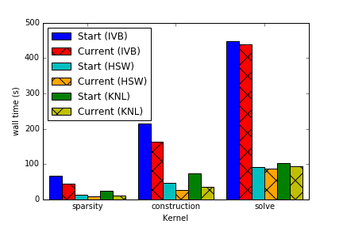

# Welcome to NERSC

Welcome to the National Energy Research Scientific Computing Center, a high performance scientific computing center.
This document will guide you through the basics of using NERSC’s supercomputers, storage systems, and services.

## What is NERSC?

NERSC provides High Performance Computing and Storage facilities and support for research sponsored by, and of interest to, the U.S. Department of Energy Office of Science. NERSC has the unique programmatic role of supporting all six Office of Science program offices: Advanced Scientific Computing Research, Basic Energy Sciences, Biological and Environmental Research, Fusion Energy Sciences, High Energy Physics, and Nuclear Physics. Scientists who have been awarded research funding by any of the offices are eligible to apply for an allocation of NERSC time. Additional awards may be given to non-DOE funded project teams whose research is aligned with the Office of Science's mission. Allocations of time and storage are made by DOE.

NERSC is a national center, organizationally part of Lawrence Berkeley National Laboratory in Berkeley, CA. NERSC staff and facilities are primarily located at Berkeley Lab's Shyh Wang Hall on the Berkeley Lab campus.


## External links

* [OLCF](https://www.olcf.ornl.gov)
* [ALCF](https://www.alcf.anl.gov)
* [NERSC](http://www.nersc.gov)

## Internal links

1. [Portability definition](pp/definition.md)


Tables:

| System Type                                   | Cray XC40   |
|-----------------------------------------------|-------------|
| Theoretical Peak Performance (System)         | 31.4 PFlops |
| Theoretical Peak Performance (Haswell nodes)  | 2.3 PFlops  |
| Theoretical Peak Performance (Xeon Phi nodes) | 29.1 PFlops |
| Compute Nodes (Haswell)                       | 2,388       |

## Include scripts/ source code

This site supports an include extension to Markdown. 

One way to run a pure MPI job on Cori is

```shell
{!demo/pure_mpi_example1.sh!}
```

!!!warning
	The `-c ` and `--cpu_bind=` options for `srun` are **required** for hybrid jobs or jobs which do not utilize all physical cores	

	
	
## Some source code

Instrumented C code to measure AI

```C
{!demo/ai.c!}
```

And some totally unrelated python code

```python
def count_cross_connections(counts):
    """Counts is a list of the number of nodes in each (non-zero) group"""
    return sum( x[0]*x[1] for x in itertools.combinations(counts, 2) )
```

## LaTex support

$$
\frac{n!}{k!(n-k)!} = \binom{n}{k}
$$

from:

```
$$
\frac{n!}{k!(n-k)!} = \binom{n}{k}
$$
```

## Images

