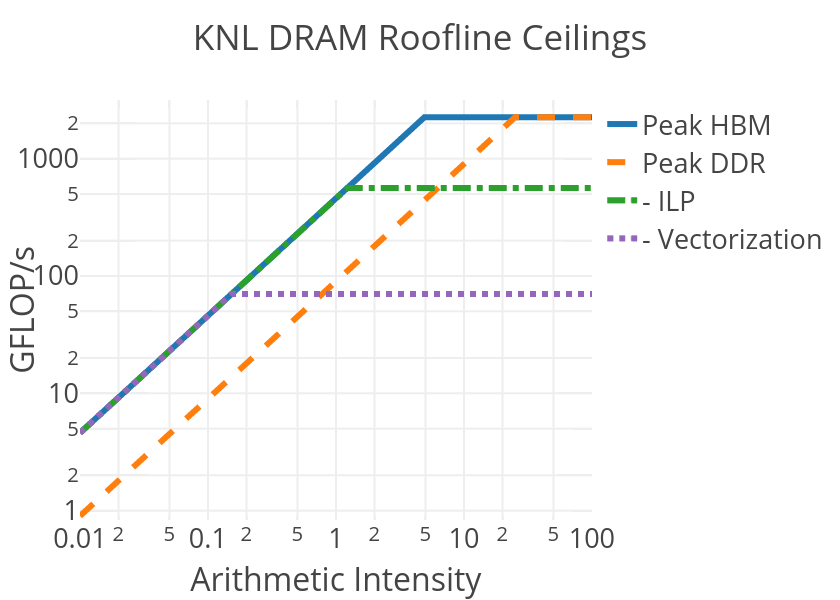

# Measuring Performance Portability

As discussed in the previous section, performance portability can be an elusive topic to quantify 
and different engineers often provide different definitions or measurement techniques. Below we characterize a few well-defined approaches.

## Measuring Portability

Measuring 'portability' itself is somewhat more well defined. One can, in principle, measure the 
total lines of code used in common across different architectures vs. the amount of code intended 
for a single architecture via ``IFDEF`` pre-processing statements, separate routines and the like. A code with 0% 
architecture specific code being completely portable and a code with a 100% architecture specific 
code being essentially made up of multiple applications for each architecture. 

One subtlety that this approach hides is that it is possible that shared source-code requires more lines than source-code intended for a single architecture 
or, in some cases, even two sets of separate source-code intended for multiple architectures. We ignore this case for now, assuming that using a portable 
approach to express an algorithm doesn't significant change the amount of code required. 

## Measuring Performance

'Performance', even on a single architecture, is a bit less simple to define and measure. In 
practice, scientists generally care about the quality and quantity of scientific output they 
produce. This typically maps for them to relative performance concepts, such as how much faster 
can a particular run or set of runs finish today than yesterday or on this machine than that. The 
drawback of trying to measure performance in this way is that the baseline is arbitrary - i.e. you 
don't know how well your code is performing on any architecture compared to how it 'should' be 
performing if it were well optimized.

One may attempt to define absolute performance as a measure of the actual floating point operations (or integer operations) per second 
(FLOPS) of an 
application during execution compared to the theoretical peak performance of the system or fraction of the system in use, as reported on the Top 500 
list - [Top500.org](https://www.top500.org) - or as reported in the system specs.

However, this is a poor measure of application performance (and a particularly poor measure to use when trying to quantify performance portability) for a 
couple reasons:

* The application or algorithm may be fundamentally limited by an aspect of the HPC system other than the compute capability (which is limited to the number 
of cores/threads, clock-speed and vector/instruction-sets)

* The application or algorithm may be fundamentally limited by *different* aspects of the system on different HPC system. 

As an example, an implementation of an algorithm that is limited by memory bandwidth may be achieving the best performance it theoretically can on systems 
with different architectures but could be achieving widely varying percentage of peaks FLOPS on the different systems. 

Instead we advocate for one of two approaches for defining performance against expected or optimal performance on the system for an algorithm:

### 1. Compare against a known, well-recognized (potentially non-portable), implementation. 

Some applications, algorithms or methods have well-recognized optimal (often hand-tuned) implementations on different architectures. These can be used as a 
baseline for defining relative performance of portable versions. Our Chroma application case-study shows this approach. [See 
here](/case_studies/qcd/overview.md) 

Many performance tools exist at ALCF, NERSC and OLCF for the purposes of profiling applications or regions of applications and determining performance 
limiters 
when comparing different implementation of an algorithm or method. See the comprehensive list [here](/facilities/tools.md) with links to detailed 
instructions and example use-cases at each site. 

### 2. Use the roofline approach to compare actual to expected performance

As discussed above, the major limitation of defining performance relative to the peak FLOPS capability of the machine is that applications in practice are 
limited by many different aspects of an HPC system. 

The roofline performance model and extensions to the roofline model attempt to take these different possibilities into account. In the 
roofline approach, one defines various 
theoretical performance ceilings for an algorithm or implementation based on its properties. In the simplest model, one may classify an algorithm based on 
its DRAM arithmetic-intensity - the ratio of the FLOPs performed vs the data moved from main-memory (DRAM) to the processor over the course of 
execution, which can be measured for a given application as described on the subpages. Below, we show the performance ceilings provided by the roofline 
model on KNL for applications as a function of their DRAM arithmetic-intensity:

Here the blue line represents the maximum performance that can be achieved on a KNL node for an application running out of the KNL High-Bandwidth Memory 
(HBM) with a given
DRAM-AI (the x-axis value). For low
values of DRAM-AI, the performance is limited by the diagonal ceiling, meaning that memory-bandwidth is the limiting hardware feature. The location of the 
diagonal lines are typically computed empirically from the available bandwidth reported by, for example, stream triad like kernels.

For high values of DRAM-AI,
memory bandwidth no longer limits performance and one can, in principle, achieve the max compute performance on the system. However, for such cases we 
may draw 
other ceilings that represent common limitations in algorithms or implementations of algorithms. The dashed-dotted green line labeled "-ILP" is the
performance ceiling for applications that: 1. do not provide a balance of multiply and add instructions, or simply don't use the Fused Multiply Add (FMA)
instructions on the processor and 2. don't have enough instruction level parallelism to keep both VPUs on the KNL busy. The dashed purple line labeled 
"-Vectorization" is performance ceiling of an algorithm or implementation that, in addition to the above two deficiencies, lacks vectorization (a 
combined factor of 32 reduction in the ceiling).

For applications that are limited by other system properties, it is possible to extend the roofline model to include related ceilings. For example, we 
commonly extend the roofline approach to use arithmetic-intensities based on data movement from different levels of cache (e.g. L1, L2 on the KNL), in order to 
discover the relevant limiting cache level. The figure below shows an example of such an extended roofline plot for an application limited by the L2 cache 
level.

In addition, for applications with non-stream like memory access patterns, lower memory-ceilings may be computed. Many codes use strided or indirect-addressed 
(scatter/gather) patterns where memory latency may be limiting resource. In such cases, it is possible to quickly craft a few line benchmark to compute the 
relevant ceiling. We should some example ceiling parameters for different access patterns determined empirically in the following tables:

For polynomial access pattern: x[i] = (x[i]+c0):

| System                | DRAM      | L2         | L1         | GEMM   |
|-----------------------| ----------|------------|------------|---------|
| Titan (Kepler)        | 161 GB/s  | 559 GB/s   | -          | 1226 GF/s  |
| Summit Dev (4 Pascal) | 1930 GB/s | 6507 GB/s  | -          | 17095 GF/s |
| Cori (KNL)            | 413 GB/s  | 1965 GB/s  | 6443 GB/s  | 2450 GF/s  |

For non-contiguous accesses on KNL as an example:

| Access Pattern  |  KNL Effective Bandwidth (Cache Mode) |
|----------|---------|
| Dot Product | 219 GB/s |
| Stride 2 Dot Product | 96 GB/s | 
| Stride 100 Dot Product | 31 GB/s |
| Stride 10000 Dot Product | 20 GB/s | 

Finally, one may additional define an AI value and roofline-ceiling for algorithms with data coming from off-node due to internode 
communication. The relevant bandwidth here is the injection bandwidth of the node:

| System:              | Cori/Theta | Titan    | Summit  |
|----------------------|------------|----------|---------|
| Injection Bandwidth: | 8 GB/s     | 6.4 GB/s | 23 GB/s |

The value of the roofline approach is that the relative performance of an application kernel to relevant ceilings (those related to fundamental limitations 
in an algorithm 
that cannot be overcome via optimization) allow us to define an absolute performance ratio for each architecture in order to quantity absolute performance 
and performance portability that accurately reflects the different limiting hardware characteristics of each system. On the following pages, we discuss how 
to collect roofline data on both KNL and GPU powered nodes. 
