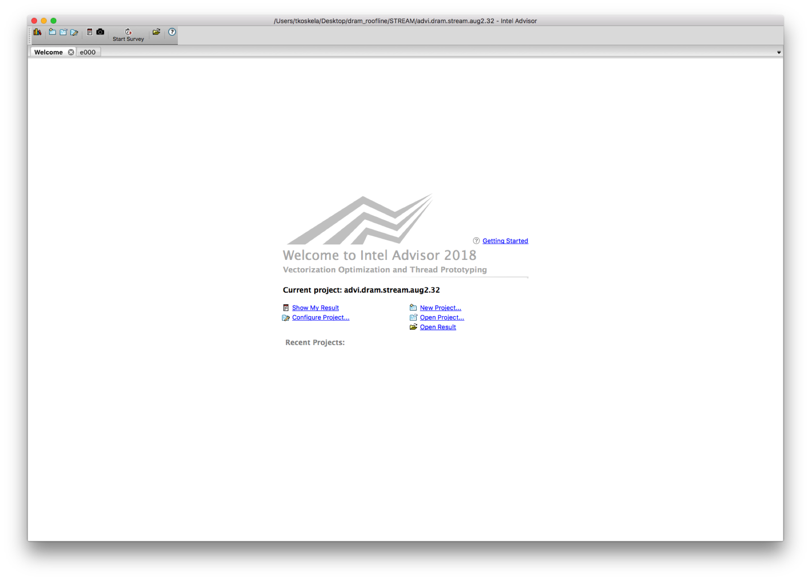
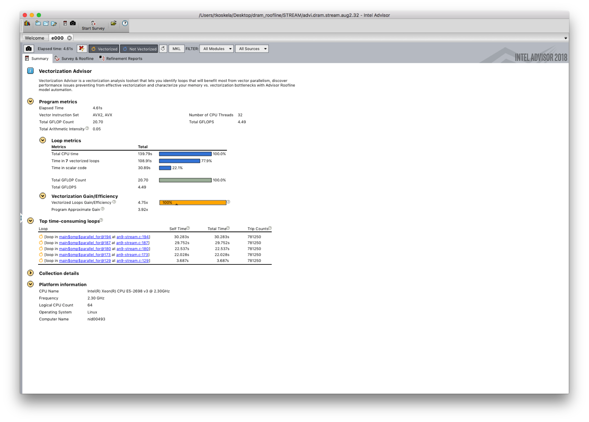
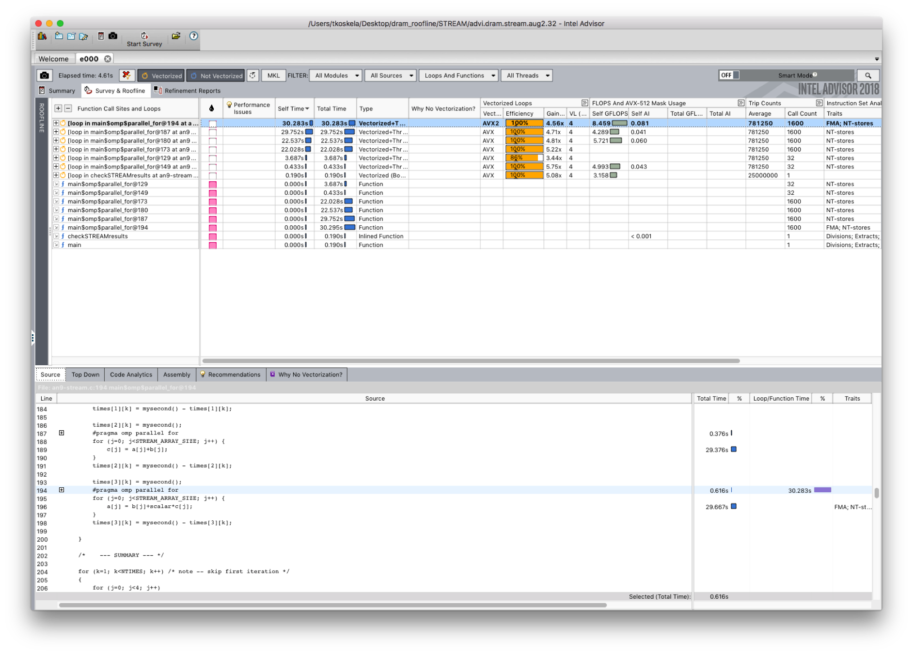

# Using SDE and VTUNE to calculate roofline data

NERSC has extensive documentation and examples for collecting AI and FLOPs using the Intel SDE and VTune 
tools. You can find instructions for this 
[here](http://www.nersc.gov/users/application-performance/measuring-arithmetic-intensity/).

# Using vector advisor to automate roofline collection

##Compiling

* Compile code with the -g flag. 

* Optimizations flags can (should) be included. 

* Using the -dynamic flag for dynamic linking is recommended.

## Running

* We recommend running applications using the command line interface advixe-cl. 

* To access the binaries, load the advisor module using module load advisor.

* Since version 2017/update 2 the roofline is a standard feature and does not require setting any additional environment variables. 

* To collect roofline data, Advisor needs to do two collection runs, survey and tripcounts. Survey is a quick pass with no noticeable overhead that is used 
to count the application run time. Tripcounts has significant overhead.
srun <srun options> advixe-cl -collect survey -project-dir <same data directory> -- <executable>
srun <srun options> advixe-cl -collect tripcounts -flops-and-masks -project-dir <same data directory> -- <executable>

*There are a number of additional flags that can be used to speed up the collection
-no-stack-stitching 
-no-auto-finalize can be used to skip the expensive data finalization step. This is recommended on KNL systems where the cores of the compute nodes are less 
powerful than the cores of the login nodes. When the results are opened in the GUI, they will be finalized on the node running the GUI.

##Using the GUI

* Load advisor using  module load advisor.

* Open the GUI with advixe-gui

The GUI opens to the welcome screen. Click on open result and navigate to the data directory you gave to advixe-cl

A new result opens to the summary page. This page gives useful overall metrics for the application and highlights the top five time-consuming loops.

Navigate to the Survey & Roofline tab using the tabs on the top of the screen. The survey lists the loops of the application and provides information on 
vectorization, flop rate, arithmetic intensity, etc.

Clink on the Roofline bar on the left to switch to the roofline view. This view shows the measured rooflines of the system and the loops of the application 
in the cache-aware roofline.

*While the above documents how to use Intel Advisor to gather L1-roofline data, you can contact NERSC 
consultants at consult@nersc.gov for information on experimental DRAM roofline capbilities.
